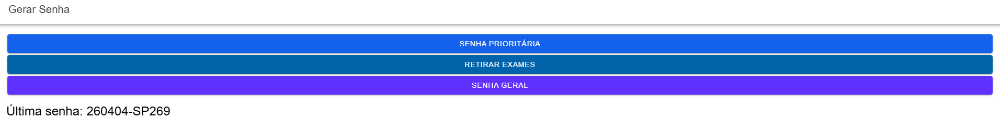
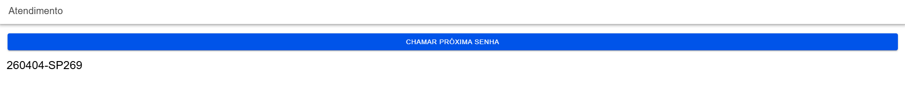
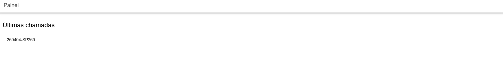

# 🎟️ MobileTicketsIonic

Aplicativo desenvolvido com Ionic + Angular para simulação de um sistema de controle de atendimento (tickets).

---

## 📱 Funcionalidades

* Geração de senhas (SP, SG, SE)
* Controle de filas com prioridade
* Chamada de senhas
* Painel com últimas 5 chamadas

---

## 🧠 Regras implementadas

* Prioridade: SP → SE → SG
* Alternância de atendimento
* 5% das senhas são descartadas
* Formato: YYMMDD-PPSQ

---

## 📸 Screenshots

### Gerar Senha



### Atendimento



### Painel



---

## ⚙️ Como executar

```bash id="g9d8v5"
npm install
ionic serve
```

---

## 📄 Licença

MIT
